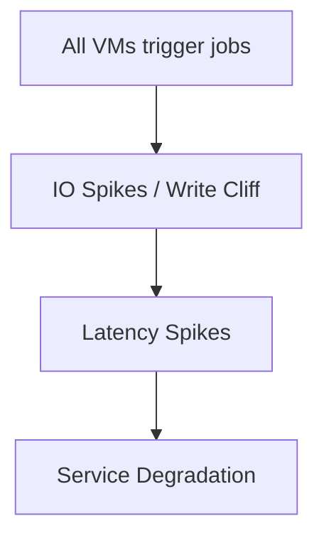

# 🌑 Midnight Fall: Mitigating a vSAN Thundering Herd on Budget Hardware

---

> **A postmortem, architectural analysis, and remediation toolkit for a severe infrastructure anomaly during a major datacenter consolidation.**

---

## 🏗️ Background: From Spaghetti to Centralized On-Prem

Before "Midnight Fall," our infrastructure was a fragile web of co-hosted servers, standalone ESXi hosts, and scattered cloud instances. To centralize and stabilize, I architected a unified, co-located on-premises environment:

- **IP topologies & VLAN routing**
- **Hardware selection**
- **VMware clustering**
- **Dedicated monitoring stack**

The new stack: a fresh VMware vSAN cluster hosting **120 Ubuntu 20.04 VMs** running heavy data & internal services (Internal Apps, Kafka, PostgreSQL, TimescaleDB & etc).

---

## 💾 Hardware Compromise & Technical Debt

I recommended enterprise Samsung PM1643 SSDs for the vSAN capacity tier. Budget constraints forced a compromise:

- **Cache Tier:** Samsung PM893 (1.92TB, enterprise)
- **Capacity Tier:** Samsung 870 EVO (1TB, consumer)

Consumer SSDs lack Power Loss Protection (PLP) and rely on small SLC write caches. Once full, they hit a "write cliff"—latency jumps from microseconds to hundreds of milliseconds.

---

## 🚨 The Anomaly

Everything ran smoothly—until **12:00 AM**. The cluster hit a wall:

- Services stuttered
- Databases lagged
- VMs hung

The monitoring stack failed alongside the application layer, leaving us blind as the cluster gasped for air.

---

## 🕵️‍♂️ The Investigation

- **vCenter Audit:** No scheduled jobs, DRS migrations, or snapshot consolidations at midnight.
- **Backup Suspect:** Disabled backup schedules—problem persisted.
- **Decoupling Observability:** Migrated monitoring tools out of the cluster. Out-of-band metrics revealed: at 12:00 AM, IOPS and latency spiked. Disks were saturated.
- **Isolating Workloads:** Shut down heavy I/O VMs—problem remained, though less severe.
- **Benchmarking the Write Cliff:** Custom script hammered disks on 5 VMs. Latency skyrocketed, reproducing the failure. The 870 EVOs' SLC caches were exhausted by synchronized I/O bursts.

---

## 💥 Root Cause: The Thundering Herd

The culprit: **Ubuntu 20.04's default logrotate job** (systemd timer/cron.daily) triggered at 12:00 AM on all 120 VMs. This created a massive, synchronized I/O storm, maxing out storage queue depth and causing the cluster to hang.

---

## 🛠️ Remediation (Scripts in this Repo)

### 1. Immediate Fix: Fleet-wide Patch

A shell script reconfigures systemd timers and cron.daily schedules, spreading them over a 3-hour window. The next night, the cluster ran smoothly.

### 2. Permanent Fix: Template Injection

The base VM template now includes a bash script with a randomization function. On first boot, each VM assigns itself a random log rotation time between 12:00 AM and 6:00 AM, neutralizing the thundering herd.

---


## 📂 Repository Contents

- `fleet_logrotate_stagger.sh` — Staggers logrotate/cron jobs across an existing Ubuntu VM fleet
- `template_randomize_cron.sh` — Injects random log rotation on first boot for new VMs
- `benchmark_write_cliff.sh` — Disk I/O stress test to reproduce the write cliff and thundering herd effect

---

## 🛠 Scripts & Usage

### 1. `fleet_logrotate_stagger.sh`
**Purpose:** Stagger logrotate/systemd timers across a time window to prevent synchronized IO spikes.

**Usage:**

```sh
sudo ./fleet_logrotate_stagger.sh --start 00:00 --end 03:00
```

**Flags:**
- `--start` — earliest time window for staggered jobs (HH:MM)
- `--end` — latest time window for staggered jobs (HH:MM)

**Preconditions:**
- Script must be run as root
- SSH access to all target VMs

**Expected Output:**
```
VM1: logrotate timer set to 00:17
VM2: logrotate timer set to 01:05
VM3: logrotate timer set to 02:42
...etc
```

---

### 2. `benchmark_write_cliff.sh`
**Purpose:** Simulate the midnight write cliff to verify cluster behavior and test mitigations.

**Usage:**

```sh
sudo ./benchmark_write_cliff.sh --duration 60 --block-size 4k
```

**Flags:**
- `--duration` — duration in seconds
- `--block-size` — IO block size to write

**Expected Output:**
- Continuous IO operations that replicate high latency
- Graph or log of latency spikes (optional: add `--log` flag to save to file)


**Orchestration Tool: Ansible Automation**

For realistic simulation and remediation, use the provided Ansible playbook to coordinate actions across your VM fleet.

### Ansible Tool Features
- **Run the benchmark** (`benchmark_write_cliff.sh`) on all or a subset of VMs
- **Remediate logrotate/systemd timer spread** (`fleet_logrotate_stagger.sh`) across all VMs

> The template randomization script (`template_randomize_cron.sh`) is not included in the playbook and should be used manually during VM image/template creation.

#### Setup
1. Edit `ansible/inventory.ini` to list your VM hostnames or IPs under the `[vms]` group.
2. Adjust variables in `ansible/site.yml` as needed (e.g., duration, block size, time window).

#### Usage
To run the playbook and perform both actions:
```
ansible-playbook -i ansible/inventory.ini ansible/site.yml -e run_benchmark=true -e spread_logrotate=true
```

To run only the benchmark:
```
ansible-playbook -i ansible/inventory.ini ansible/site.yml -e run_benchmark=true
```

To run only the logrotate spread remediation:
```
ansible-playbook -i ansible/inventory.ini ansible/site.yml -e spread_logrotate=true
```

**Batch Control:**
- Start with a subset of VMs in your inventory, then add more in each batch to observe saturation and latency effects.
- Stop all benchmarks with a single command if needed (e.g., using pkill via Ansible).

---

### 3. `template_randomize_cron.sh`
**Purpose:** Inject randomness into cron schedules for new VM templates. Prevents future thundering herds.

**Usage:**

```sh
sudo ./template_randomize_cron.sh /etc/cron.d/my-template
```

**Preconditions:**
- Must be run before cloning the VM template
- Target file must be readable and writable

**Expected Output:**
```
Template cron job randomized: 02:14
Template cron job randomized: 01:37
```

---

## ⏱ Midnight Cascade Timeline

```
00:00 ─ All VMs trigger default cron/logrotate jobs
00:05 ─ vSAN write queue saturated
00:10 ─ Latency spikes across cluster
00:15 ─ Critical services slow / errors appear
00:30 ─ Services recover as cron jobs finish
```

## Visual Diagram



---

## 🤝 Author

**Ali Fattahi**  
Senior Infrastructure Engineer & Linux System Administrator

[Connect on LinkedIn](https://www.linkedin.com/in/ali-fattahi)

---

> _This repository is a technical case study on the realities of running enterprise workloads on budget hardware, the dangers of default OS behaviors, and the critical importance of out-of-band observability._
