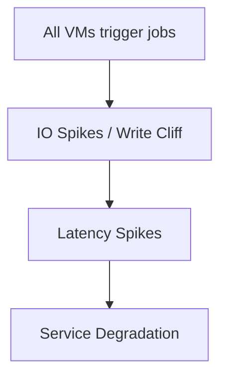

# 🌑 Midnight Fall: Mitigating a vSAN Thundering Herd on Budget Hardware


---

> **A postmortem, architectural analysis, and remediation toolkit for a severe infrastructure anomaly during a major datacenter consolidation.**

---

## 🏗️ Background: From Spaghetti to Centralized On-Prem

Before "Midnight Fall," our infrastructure was a fragile web of co-hosted servers, standalone ESXi hosts, and scattered cloud instances. To centralize and stabilize, I architected a unified, co-located on-premises environment:

- **IP topologies & VLAN routing**
- **Hardware selection**
- **VMware clustering**
- **Dedicated monitoring stack**

The new stack: a fresh VMware vSAN cluster hosting **120 Ubuntu 20.04 VMs** running heavy data & internal services (Internal Apps, Kafka, PostgreSQL, TimescaleDB & etc).

---

## 💾 Hardware Compromise & Technical Debt

I recommended enterprise Samsung PM1643 SSDs for the vSAN capacity tier. Budget constraints forced a compromise:

- **Cache Tier:** Samsung PM893 (1.92TB, enterprise)
- **Capacity Tier:** Samsung 870 EVO (1TB, consumer)

Consumer SSDs lack Power Loss Protection (PLP) and rely on small SLC write caches. Once full, they hit a "write cliff"—latency jumps from microseconds to hundreds of milliseconds.

---

## 🚨 The Anomaly

During sanity and integrity test of cluster everything ran smoothly—until **12:00 AM**. The cluster hit a wall:

- Services stuttered
- Databases lagged
- VMs hung

The monitoring stack failed alongside the application layer, leaving us blind as the cluster gasped for air.

---

## 🕵️‍♂️ The Investigation

- **vCenter Audit:** No scheduled jobs, DRS migrations, or snapshot consolidations at midnight.
- **Backup Suspect:** Disabled backup schedules—problem persisted.
- **Decoupling Observability:** Migrated monitoring tools out of the cluster. Out-of-band metrics revealed: at 12:00 AM, IOPS and latency spiked. Disks were saturated.
- **Isolating Workloads:** Shut down heavy I/O VMs—problem remained, though less severe.
- **Benchmarking the Write Cliff:** Custom script hammered disks on 10 VMs. Latency skyrocketed, reproducing the failure. The 870 EVOs' SLC caches were exhausted by synchronized I/O bursts.

---

## 💥 Root Cause: The Thundering Herd

The culprit: **Ubuntu 20.04's default logrotate job** (systemd timer/cron.daily) triggered at 12:00 AM on all 120 VMs. This created a massive, synchronized I/O storm, maxing out storage queue depth and causing the cluster to hang.

---

## 🛠️ Remediation (Scripts in this Repo)

### 1. Immediate Fix: Fleet-wide Patch

A shell script reconfigures systemd timers and cron.daily schedules, spreading them over a 3-hour window. The next night, the cluster ran smoothly.

### 2. Permanent Fix: Template Injection

The base VM template now includes a bash script with a randomization function. On first boot, each VM assigns itself a random log rotation time between 12:00 AM and 6:00 AM, neutralizing the thundering herd.

---


## 📂 Repository Contents

- `fleet_logrotate_stagger.sh` — Staggers logrotate/cron jobs across an existing Ubuntu VM fleet
- `template_randomize_cron.sh` — Injects random log rotation on first boot for new VMs
- `benchmark_write_cliff.sh` — Disk I/O stress test to reproduce the write cliff and thundering herd effect

---

## 🛠 Scripts & Usage


### 1. `fleet_logrotate_stagger.sh`
**Purpose:** Stagger logrotate/systemd timers across a time window to prevent synchronized IO spikes.

**Usage Example:**
```sh
sudo ./fleet_logrotate_stagger.sh
```

**Arguments & Flags:**
*No arguments required. The script randomizes the logrotate/cron.daily job start time for each VM within a 3-hour window after midnight.*

**Preconditions:**
- Must be run as root (sudo)
- Should be executed on each VM in the fleet (can be distributed via automation tools)
- Target system must use either systemd logrotate.timer or /etc/crontab for cron.daily

**Expected Output:**
```
Logrotate and cron.daily jobs staggered by XX minutes after midnight.
```
*Where XX is a random number between 0 and 179.*

**How to Verify Success:**
- Check `/etc/systemd/system/logrotate.timer.d/stagger.conf` for a new OnCalendar override (if using systemd)
- Or, check `/etc/crontab` for a randomized minute on the cron.daily line
- Run `systemctl list-timers | grep logrotate` to see the next scheduled time

**Error Handling:**
- Script exits on error (`set -e`)
- If systemd or crontab is not present, script will silently skip that method
- If not run as root, script will fail with a permission error

---


### 2. `benchmark_write_cliff.sh`
**Purpose:** Disk I/O stress test to reproduce the write cliff and thundering herd effect on vSAN/consumer SSDs.

**Usage Example:**
```sh
sudo ./benchmark_write_cliff.sh
```

**Arguments & Flags:**
*No arguments required. To customize, edit the script variables for block size, total size, and runtime.*
	- `BLOCK_SIZE` (default: 4K)
	- `TOTAL_SIZE` (default: 2G)
	- `RUNTIME` (default: 300 seconds)

**Preconditions:**
- Must be run as root (sudo)
- Requires `fio` installed on the system
- Sufficient disk space in `/tmp` for the test file

**Expected Output:**
- FIO output showing write and read performance, IOPS, and latency
- Example output:
	```
	write_cliff_test: (groupid=0, jobs=4): err= 0: pid=...: ...
		write: IOPS=..., BW=..., Latency=...
	read_cliff_test: (groupid=0, jobs=4): err= 0: pid=...: ...
		read: IOPS=..., BW=..., Latency=...
	```

**How to Verify Success:**
- Script completes without error
- FIO output is displayed in the terminal
- `/tmp/benchmark_write_cliff.testfile` is created and deleted

**Error Handling:**
- Script exits on error (`set -e`)
- If `fio` is not installed, script will fail with a command not found error
- If insufficient disk space, fio will report an error


**Orchestration Tool: Ansible Automation**

For realistic simulation and remediation, use the provided Ansible playbook to coordinate actions across your VM fleet.

### Ansible Tool Features
- **Run the benchmark** (`benchmark_write_cliff.sh`) on all or a subset of VMs
- **Remediate logrotate/systemd timer spread** (`fleet_logrotate_stagger.sh`) across all VMs

> The template randomization script (`template_randomize_cron.sh`) is not included in the playbook and should be used manually during VM image/template creation.

#### Setup
1. Edit `ansible/inventory.ini` to list your VM hostnames or IPs under the `[vms]` group.
2. Adjust variables in `ansible/site.yml` as needed (e.g., duration, block size, time window).

#### Usage
To run the playbook and perform both actions:
```
ansible-playbook -i ansible/inventory.ini ansible/site.yml -e run_benchmark=true -e spread_logrotate=true
```

To run only the benchmark:
```
ansible-playbook -i ansible/inventory.ini ansible/site.yml -e run_benchmark=true
```

To run only the logrotate spread remediation:
```
ansible-playbook -i ansible/inventory.ini ansible/site.yml -e spread_logrotate=true
```

**Batch Control:**
- Start with a subset of VMs in your inventory, then add more in each batch to observe saturation and latency effects.
- Stop all benchmarks with a single command if needed (e.g., using pkill via Ansible).

---


### 3. `template_randomize_cron.sh`
**Purpose:** Inject randomness into cron schedules for new VM templates. Prevents future thundering herds.

**Usage Example:**
```sh
sudo ./template_randomize_cron.sh
```

**Arguments & Flags:**
*No arguments required. The script randomizes logrotate/systemd timer or cron.daily for the template VM.*

**Preconditions:**
- Must be run as root (sudo)
- Should be executed on the golden/template VM before cloning or distributing
- Target system must use either systemd logrotate.timer or /etc/crontab for cron.daily

**Expected Output:**
```
Logrotate/cron.daily randomized to HH:MM (first boot only).
```
*Where HH:MM is a random time between 00:00 and 06:00.*

**How to Verify Success:**
- Check `/etc/systemd/system/logrotate.timer.d/randomize.conf` for a new OnCalendar override (if using systemd)
- Or, check `/etc/crontab` for a randomized time on the cron.daily line
- Run `systemctl list-timers | grep logrotate` to see the next scheduled time
- The flag file `/var/lib/logrotate_randomized.flag` should exist after first run

**Error Handling:**
- Script exits on error (`set -e`)
- If systemd or crontab is not present, script will silently skip that method
- If not run as root, script will fail with a permission error

---


---

## ⏱ Midnight Cascade Timeline

```
00:00 ─ All VMs trigger default cron/logrotate jobs
00:05 ─ vSAN write queue saturated
00:10 ─ Latency spikes across cluster
00:15 ─ Critical services slow / errors appear
00:30 ─ Services recover as cron jobs finish
```

## Visual Diagram



---

## 🤝 Author

**Ali Fattahi**  
Senior Infrastructure Engineer & Linux System Administrator

[Connect on LinkedIn](https://www.linkedin.com/in/ali-fattahi)

---

> _This repository is a technical case study on the realities of running enterprise workloads on budget hardware, the dangers of default OS behaviors, and the critical importance of out-of-band observability._
